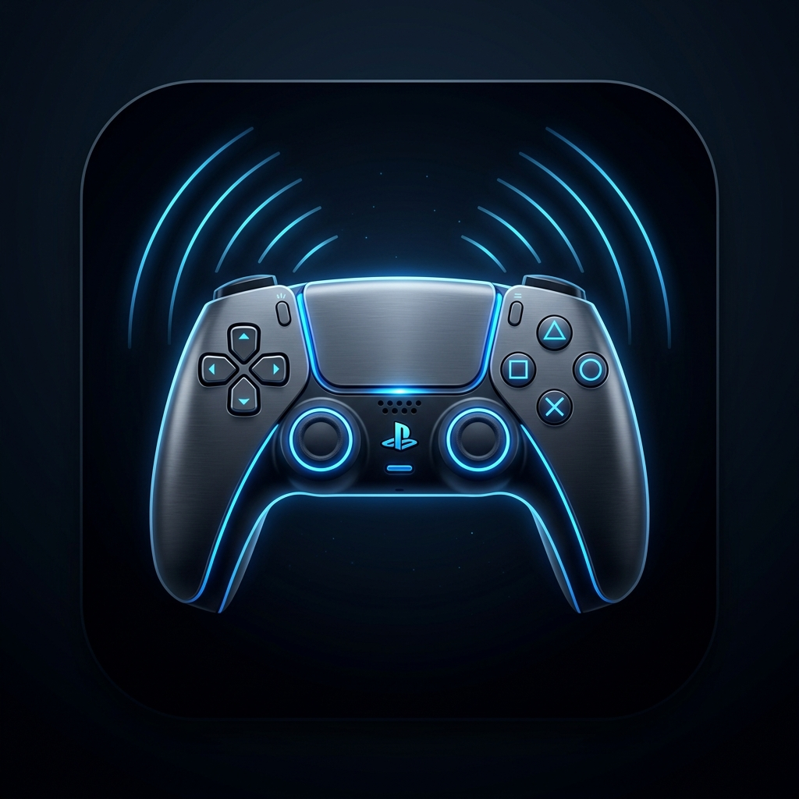

# VCRLT Game Pad 🎮

Turn your Android smartphone into a low-latency wireless PlayStation 5 DualSense controller for PC gaming, paired with a zero-configuration Windows receiver that maps inputs straight to XInput/ViGEm.



---

## 🚀 Features

- **Full DualSense Layout & 2 dani.x240 Models**:
  - **dani.x240 Stealth Black**: Matte obsidian black console body with authentic Sony colors (Teal ▲, Coral ●, Blue ✕, Pink ■)
  - **dani.x240 Cyber Neon**: Deep midnight space blue with glowing white geometric glyphs and glowing cyan analog stick halos
  - Symmetrical dual analog sticks with dedicated **L3** and **R3** corner click triggers
  - Angled **L1 / L2** and **R1 / R2** shoulder bumpers and triggers
  - Center multi-touch **Touchpad** with click (for in-game maps and inventory)
  - Labeled **Share**, **PS**, and **Option** buttons
- **4 Fast Connection Methods**:
  - **Wi-Fi**: Automatic connection across your home network.
  - **Phone Hotspot**: Connect PC to phone hotspot with no external router needed.
  - **USB Cable**: Plug-in USB tethering for direct 0ms latency.
  - **Bluetooth**: Direct wireless Bluetooth gamepad pairing.
- **Zero-Configuration Windows Receiver**:
  - Automatically recognizes inputs and connects seamlessly
  - Injects directly into Windows as an XInput Virtual Gamepad (Steam, Epic Games, EA, Xbox, emulators)
  - Interactive live button feedback visualizer
  - Bi-directional rumble haptics support

---

## 📦 Automated GitHub Builds (Get APK & EXE)

This repository includes pre-configured **GitHub Actions CI/CD pipelines** that automatically compile the Android APK and Windows EXE as soon as you push code to GitHub:

### 1. Push to GitHub
If using Git:
```bash
git init
git add .
git commit -m "Initial commit - VCRLT Game Pad"
git branch -M main
git remote add origin https://github.com/YOUR_USERNAME/YOUR_REPO_NAME.git
git push -u origin main
```
*(Or use the **Export to GitHub** feature directly from Google AI Studio).*

### 2. Automatic Cloud Builds
GitHub will automatically trigger two workflows:
- **`Build VCRLT Android APK`**: Scaffolds the Android project, runs Flutter 3.29, and compiles release APKs (`app-release.apk` & ABI splits).
- **`Build VCRLT Windows Receiver EXE`**: Compiles the native Windows desktop receiver executable (`vcrlt_windows_receiver.exe`) packaged inside `VCRLT-PC-Receiver-Windows-x64.zip`.

### 3. Download the Binaries
1. Go to your repository on **GitHub.com**.
2. Click the **Actions** tab at the top.
3. Click the latest workflow run.
4. Scroll to the **Artifacts** section at the bottom to download:
   - **`VCRLT-Controller-Android-APKs`** (Install directly on your phone)
   - **`VCRLT-PC-Receiver-Windows-x64`** (Run directly on your PC)

---

## 📱 How to Connect Phone & PC

### Method A: Home Wi-Fi
1. Connect both your phone and PC to the same Wi-Fi network.
2. Open `vcrlt_windows_receiver.exe` on your PC.
3. Open `VCRLT Game Pad` on your phone and tap **Connect**.

### Method B: Phone Mobile Hotspot (Play Anywhere!)
1. Turn on **Personal Hotspot** on your phone.
2. Connect your PC to your phone's Hotspot Wi-Fi.
3. Open the PC Receiver and tap **Connect** on your phone. Everything pairs directly without an external router!

---

## 📁 Repository Structure

```
├── .github/workflows/
│   ├── android.yml          # Automated Android APK build workflow
│   └── windows.yml          # Automated Windows EXE build workflow
├── flutter_source/
│   ├── android_controller/  # Complete Flutter source code for Android APK
│   ├── windows_receiver/    # Complete Flutter source code for Windows EXE
│   └── protocol/            # High-speed UDP packet definition
├── src/                     # React web simulator & actions studio
├── public/                  # App icon, logo, and static assets
└── README.md                # Project documentation
```
